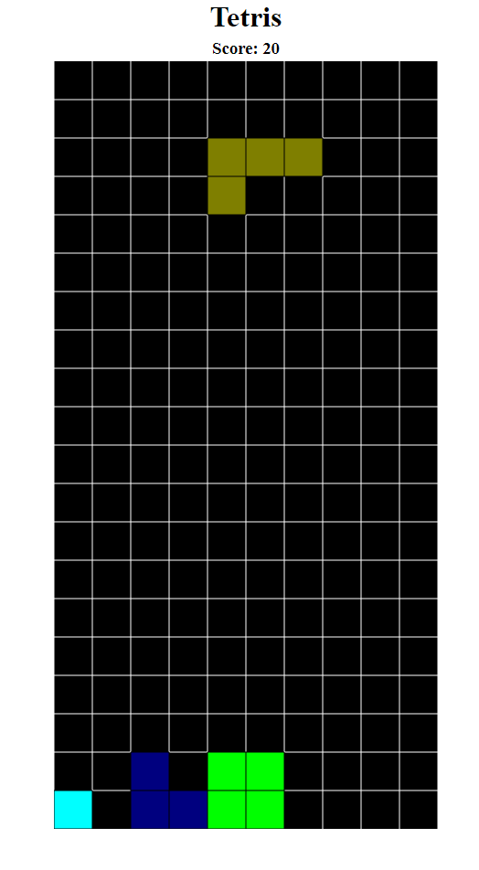

# Tetris!

## Introduction

A Tetris game built with Webgl.

## Installation

1. Make sure you have **npm** installed on your machine.
2. Using command `npm i` at the assignment directory.
3. Using command `npm run dev` to run the local server, the default port number on localhost is `3000`, so you can access it via `localhost:3000`.
4. Enjoy the game!

## Features

Contains 7 types of shapes, press `q` to quit, `r` to restart.

Added a score system, Removing one row will increase the score by **10**, restart the game will reset the score to 0.

For row removing, any row that is full in the game will be removed regardless of if it is the bottom row.
